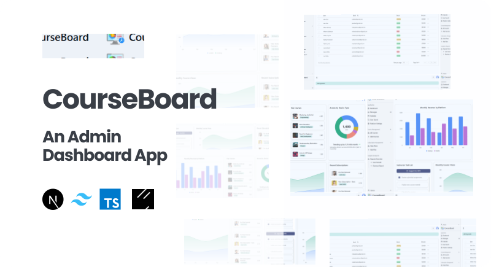

<p align="center">
  
</p>

##

<p align="center">
  
  
  
</p>

<h1 align="center">📊 CourseBoard</h1>

<p align="center">
  <b>CourseBoard</b> is a frontend admin dashboard designed for subscription-based learning platforms.  
  It provides tools to manage courses, track user subscriptions, and visualize engagement using a clean and responsive interface built with <b>Next.js</b>, <b>Tailwind CSS</b>, and <b>Shadcn UI</b>.
</p>

---

## ✨ Features

- 📚 Manage and organize course data
- 👥 Track subscriptions and active users
- 📊 Visualize engagement with interactive dashboards
- 🎨 Modern UI with **Tailwind CSS** + **Shadcn UI**
- ⚡ Optimized and responsive frontend powered by **Next.js**

---

## 🌐 Demo

🔗 **Live Demo**: [CourseBoard](https://courseboard.vercel.app)

---

## ⚡ Quick Start

Follow these steps to get a local copy of the project up and running.

### 1️⃣ Clone the repository

```bash
git clone https://github.com/Renz-Eryll/CourseBoard.git
```

### 2️⃣ Install dependencies

```bash
npm install
```

### 3️⃣ Start the development server

```bash
npm run dev
```

Open **http://localhost:3000** in your browser to view the courseboard

---

## 📧 Contact

- **Name**: Renz Eryll Ramelo
- **LinkedIn**: [www.linkedin.com/in/renz-eryll-ramelo](https://www.linkedin.com/in/renz-eryll-ramelo)
- **GitHub**: [https://github.com/Renz-Eryll](https://github.com/Renz-Eryll)
